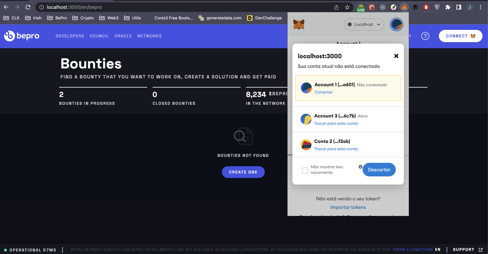
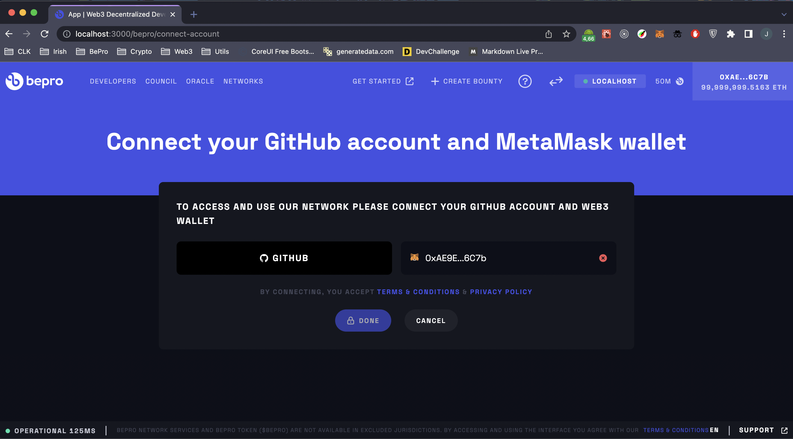
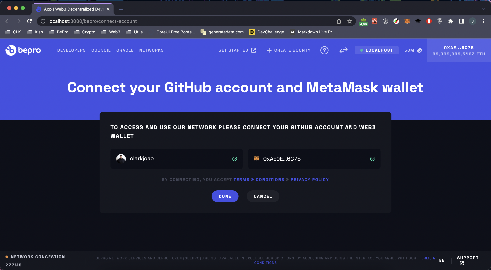
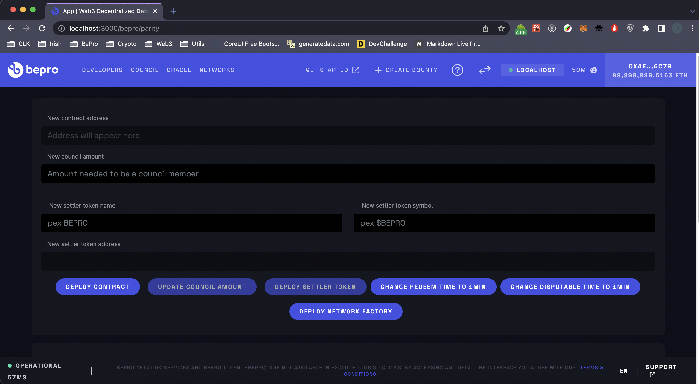
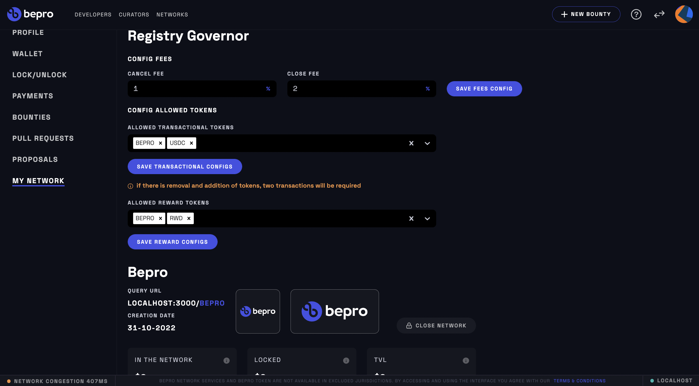

<!-- Using h2 instead of h1 because npm doesn't support align=center on h1 tags -->
<h2 align="center">
  <a href="#readme" title="WebApp README.md"></a>
</h2>

<h3 align="center">
  A tool to attach in Git Protocol Centralized SDKs to create incentives for developers to decentralize development in a liquid and scalable manner.
</h3>

<p align="center">
  <a href="#2-getting-started">Getting Started</a> •
  <a href="#3-environment-configuration">Enviroment</a> •
  <a href="#4-running">Running</a> •
  <a href="#7-contributing">Contributing</a> •
  <a href="#8-join-in-us-community">Community</a> •
</p>

---

# How it Works?

## 1. Prerequisites

- [NodeJS](https://nodejs.dev/) in v16.13 or newer.
- [Docker](https://docs.docker.com/desktop/#download-and-install) or [PostgresSQL](https://www.postgresql.org/download/) in version 13.
- [Metamask](https://metamask.io/download/)
- [Github OAuth Apps](https://docs.github.com/en/developers/apps/building-oauth-apps)
- [Github Token](https://docs.github.com/en/authentication/keeping-your-account-and-data-secure/creating-a-personal-access-token)

## 2. Getting Started

Install project dependencies:

```bash
$ npm install
```

Create database:

```bash
$ docker-compose up -d
```
<br>


## 3. Environment Configuration

Before start the project, you need to set required environment variables.

First copy or create a file _.env_ from the file _.env.exemple_
```console
$ cp .env.exemple .env
```

*`* You need to follow all the required steps for the project to run correctly.`*

- `*` [MetaMask Setup](./docs/METAMASK.md)
- `*` [Authentication Setup](./docs/AUTHENTICATION.md)
- `*` [Github Gateway](./docs/GITHUB-GATEWAY.md)
- `*` [IPFS/Infura Host](./docs/IPFS.md)
- [Ganache](./docs/GANACHE.md)
- [IP-Api](./docs/IP-API.md)
- [Twitter Gateway](./docs/TWITTER-GATEWAY.md)

<br>

## 4. Running

After you have completed the [Environment Configuration](#3-enviroment-configuration) step, you are ready to run the project.

make sure your database is up and run migrations:

```bash
$ npm run migrate
```

start project with:

```bash
$ npm run dev
```

and start a script to listen past events from blockchain:

```bash
$ npm run schedules
```
<br>

### Connecting Github and Metamask.

With you project running, you must access your domain, and connect you wallet.
<br/>

>

<br>

After you must connect with github.
<br/>

>

<br>

And if every runing well, you will see this page
<br/>

>

<br>

<br>

### Parity Configuration
*`Attention, if you chose running with Ganache you can skip this step`*

if you are the owner of the wallet configured as admin in the previous steps, you must access the parity page in `yourdomain/defaultnetworkname/parity`, to deploy a new contract in ethereum blockchain.

Parity page in `yourdomain/defaultnetworkname/parity`
<br/>

> 
<br/>

With the new contract address deployed, you must update .env again in
```text
.env

NEXT_PUBLIC_CONTRACT_ADDRESS=
NEXT_PUBLIC_SETTLER_ADDRESS=
NEXT_PUBLIC_TRANSACTION_ADDRESS=
```
<br>


### Network Configuration

finally we can finish, the last step is configure the network,
to learn more about networks inside webapp, read the [doc](./docs/NETWORK-MANAGER.md).

In short, you can own one network, with you branding, bounties and repositories.

<br/>
>
## 5. Container
Soon.

<br>

## 6. Deploy
<br>
Soon.

## 7. Contributing

See [CONTRIBUTING.md](https://github.com/bepro/webapp/CONTRIBUTING.md) for our guide to contributing to web-network.

## 8. Join in us Community

- [Discord](https://discord.gg/9aUufhzhfm)
- [Telegram](https://t.me/betprotocol)

<br/>

