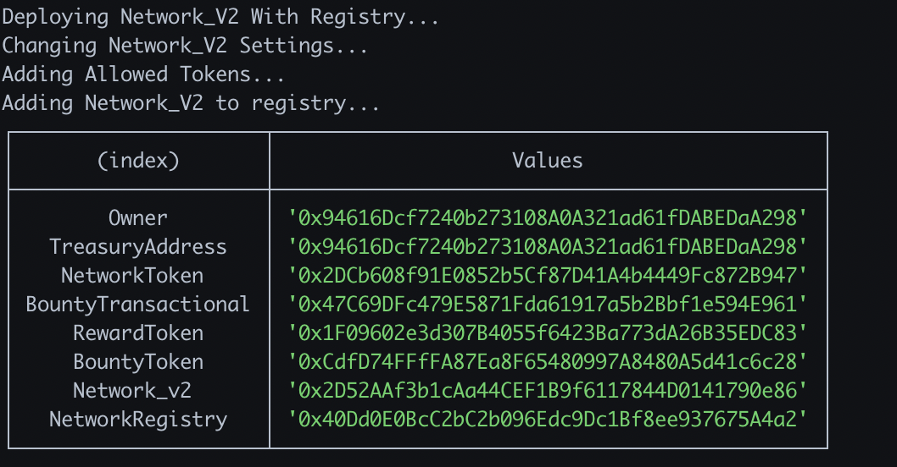

## 1. DEPLOY SMART-CONTRACT

Fill in the `governor` wallet private key and address.

```
# Deploy Contract
NEXT_PUBLIC_ADMIN_WALLET_ADDRESS=
DEPLOY_PRIVATE_KEY=

```

Then will be able to use an already deployed contract or deploy a new one, in this step pay attention because the **order to run database migrations** is differente in each option.

### Option A - Use Existing Contract

1. Just update the .env file with the respective addresses.

```text
# .env

NEXT_PUBLIC_CONTRACT_ADDRESS=
NEXT_PUBLIC_SETTLER_ADDRESS=
NEXT_PUBLIC_TRANSACTION_ADDRESS=
NEXT_PUBLIC_NETWORK_REGISTRY_ADDRESS=
NEXT_PUBLIC_NFT_ADDRESS=
NEXT_PUBLIC_NFT_URI=
```

2. Run migrations.

```bash
$ npm run migrate
```

### Option B - Deploy New Contract

Before run the script, it's possible to configure some aspects for deploy, like `staging-accounts` visiting `./scripts/staging-accounts.js` or the default values and tokens, visiting `./scripts/deploy-v2.js`

1. Run migrations.

```bash
$ npm run migrate
```

2. Make sure your database is running and run deploy script.

```bash
$ npm run deploy:local
```

if all goes well you should see this feedback.
**It's not necessary update .env file in this case.**

> 
