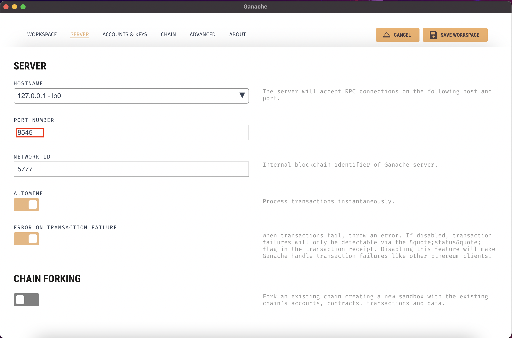
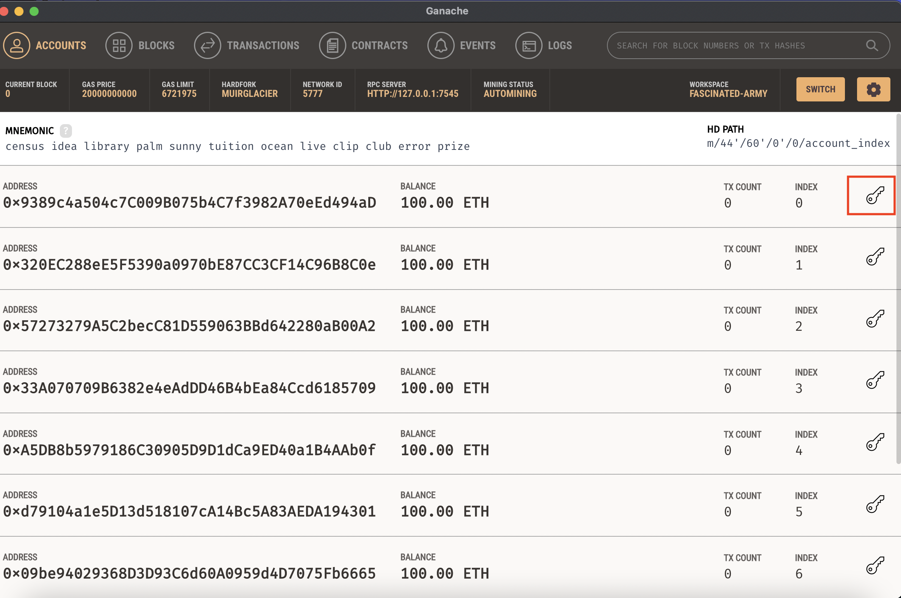
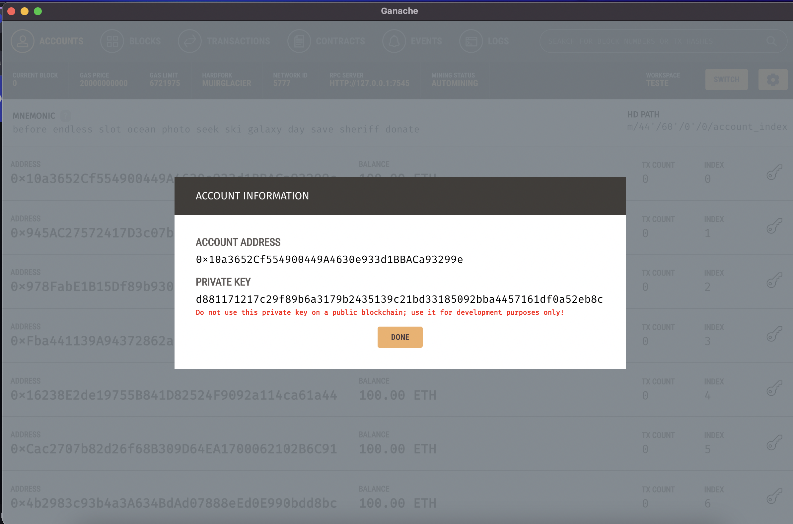
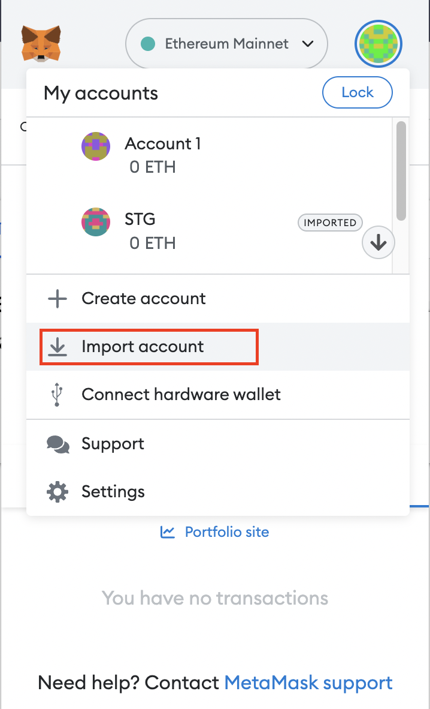
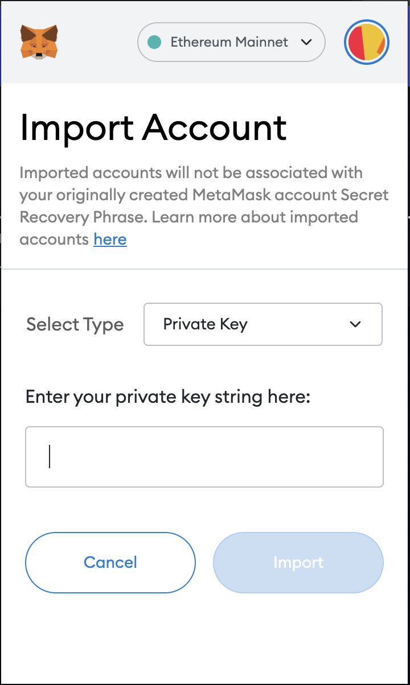
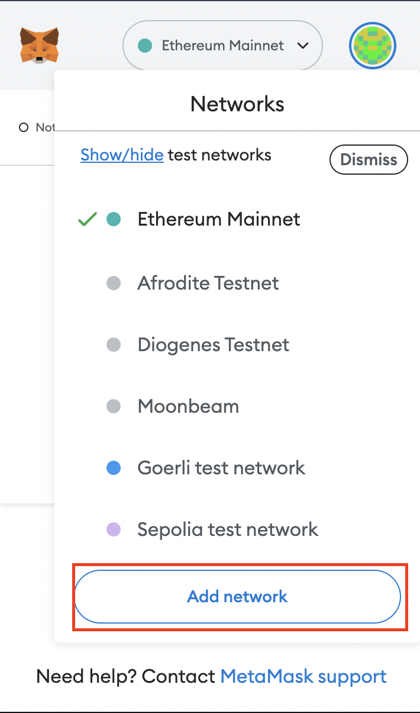
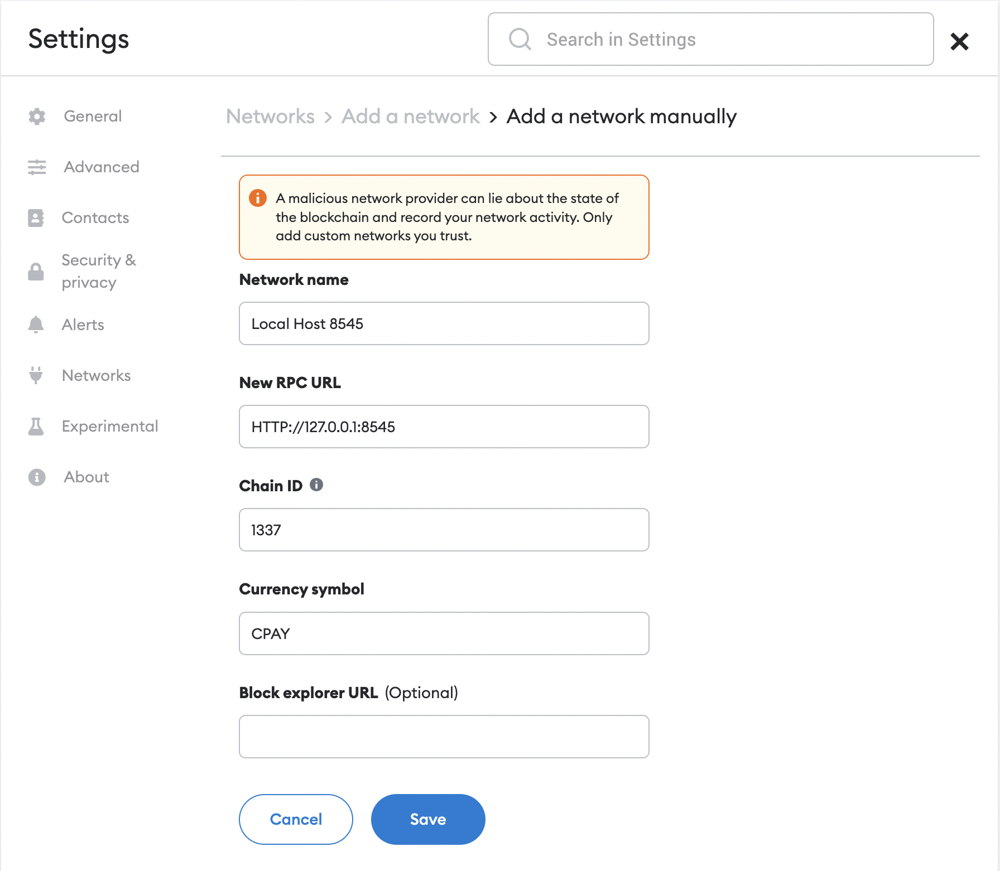

## 1. GANACHE

Ganache is a personal blockchain for rapid Ethereum and Corda distributed application development. Ganache can be used for the entire development cycle; enabling you to develop, deploy, and test your dApps in a safe and deterministic environment.

read more about in [doc](https://trufflesuite.com/docs/ganache/).

<br/>

## 2. CONFIGURING GANACHE WORKSPACE.

1. After installing ganache, create a new ethereum workspace
> 
<br/>

2. On the server tab, change the network id to `1337`
> 
<br/>

3. On Ganache Home, chose one wallet and copy the private key

> 
<br/>

> 
<br/>

1. Go to Meta Mask, click in `Import Wallet` and put the Private Key.

> 
<br/>

> 
<br/>

5. On metamask yet, click to add network, and complete with ganache info.

> 
<br/>

> 
<br/>

<br/>

## 3. DEPLOY NEW CONTRACT IN GANACHE.

1. Update the .env file with the wallet private key and address

```text
# .env

#Deploy Contract
DEPLOY_OWNER_ADDRESS=
DEPLOY_PRIVATE_KEY=
```

2. to make deploy, run

```bash
$  node ./scripts/deploy-v2 -n custom -u 'http://127.0.0.1:7545'
```

The console should output the deployed contracts.

```bash
Deploying Bepro Network on custom - http://localhost:7545
Deployed Bepro on 0xB07F50EBc910F3AB52742629f17f9E0DdBe0Fe14
...
Deployed Network Factory on 0x8e4dE4A261eA6963Da54b09Eb24422480f44bD3A
Deployed Bounty Token on 0x1B762a3902c4BC5eB3E2795408F7db8f50d44519
Deployed Network on 0xF0c0ffF429349413f4Ad43B7FC912228f2b109Cd
Setting Redeeem time on 0xF0c0ffF429349413f4Ad43B7FC912228f2b109Cd
Setting Disputable time on 0xF0c0ffF429349413f4Ad43B7FC912228f2b109Cd
Set Bounty Token Dispatcher 0xF0c0ffF429349413f4Ad43B7FC912228f2b109Cd
```

3. Update the .env with the contract addresses

```text
# .env

NEXT_PUBLIC_CONTRACT_ADDRESS=BeproContractAddress
NEXT_PUBLIC_SETTLER_ADDRESS=ERC20ContractAddress
NEXT_PUBLIC_TRANSACTION_ADDRESS=ERC20ContractAddress
NEXT_PUBLIC_NETWORK_FACTORY_ADDRESS=NetworkFactoryAddress
```