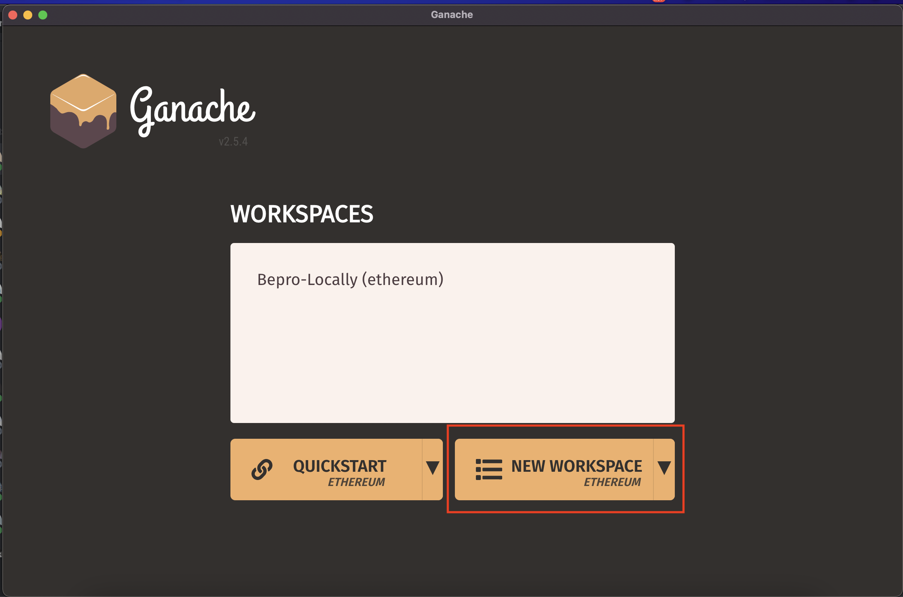

## 1. GANACHE

Ganache is a personal blockchain for rapid Ethereum and Corda distributed application development. You can use Ganache across the entire development cycle; enabling you to develop, deploy, and test your dApps in a safe and deterministic environment.

read more about in [doc](https://trufflesuite.com/docs/ganache/).

<br/>

## 2. CONFIGURING GANACHE SPACEWORK.

1. After install ganache, create a new etherium workspace
> 
<br/>

2. On the server tab, change the network id to `1337`
> 
<br/>

3. On Ganache Home, chose one wallet add copy the private key

> 
<br/>

> 
<br/>

4. Go to your Meta Mask, click in `Import Wallet` and put the Private Key.

> 
<br/>

> 
<br/>

5. On your Meta Mask yet, click to add network, and complete with ganache info.

> 
<br/>

> 
<br/>

<br/>

## 3. DEPLOY NEW CONTRACT IN GANACHE.

1. On your .env file, set your private key.

```text
.env
NEXT_GANACHE_HOST=http://127.0.0.1
NEXT_GANACHE_PORT=7545
NEXT_GANACHE_WALLET_PRIVATE_KEY=
```

2. to make deploy, run

```bash
$ npm run ganache:deploy
```

if all goes well, you will see without your console something like.

```bash
ERC20 Contract Address: 0x2391c186F6813BDD167a360c3EeE98232e1b0080
Network Contract Address: 0x10d3Dcc3BC74c22B6482AF74038d890983C65659
```

3. Update your .env with Contract address

```text
.env

NEXT_PUBLIC_CONTRACT_ADDRESS=NetworkContractAddress
NEXT_PUBLIC_SETTLER_ADDRESS=ERC20ContractAddress
NEXT_PUBLIC_TRANSACTION_ADDRESS=ERC20ContractAddress
```